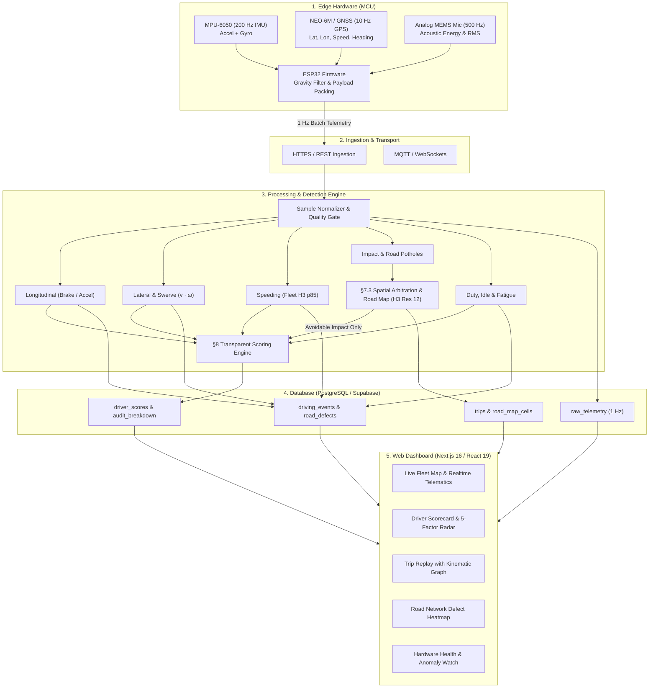

# RoadScore (R1) 🚗⚡

> **Edge Telematics, Crowd-Sourced Road Quality Mapping & Transparent Driver Safety Scoring**

RoadScore is an end-to-end, multi-tier telematics and safety intelligence platform. It fuses high-frequency IMU, GPS, and acoustic sensor streams on low-cost edge hardware (ESP32), processes high-throughput telemetry pipelines in Node.js/TypeScript, arbitrates road defects versus driver misconduct through spatial consensus, and delivers real-time fleet intelligence with transparent, auditable safety scoring.

---

## 🏛️ System Architecture



---

## 📦 Monorepo Structure

| Package / Directory | Technology Stack | Description |
| :--- | :--- | :--- |
| [`/mcu`](file:///home/gav/Projects/roadscore-r1/mcu) | C++ / Arduino / PlatformIO (ESP32) | Embedded firmware sampling MPU6050, GPS, and MEMS mic with offline ring buffer and TLS sync. |
| [`/engine`](file:///home/gav/Projects/roadscore-r1/engine) | TypeScript / Node.js 20+ / Vitest | Core detection, spatial H3 road mapping, defect arbitration, predictive hazards, and scoring math. |
| [`/web`](file:///home/gav/Projects/roadscore-r1/web) | Next.js 16 / React 19 / Tailwind CSS | Operations dashboard, real-time driver scorecards, live trip replay, and road quality visualizer. |
| [`/db`](file:///home/gav/Projects/roadscore-r1/db) | PostgreSQL / Supabase SQL | Database schema, PostGIS/H3 geospatial extensions, RLS policies, continuous scoring views. |

---

## 🎯 5-Factor Safety Pillars

RoadScore scores driving behavior across 5 physically grounded pillars (0–100 baseline):

```
                       Longitudinal Dynamics
                             (100)
                              / \
                             /   \
                            /     \
    Eco & Operational      /       \      Cornering & Lateral
         (100) -----------+---------+----------- (100)
           \             /           \             /
            \           /             \           /
             \         /               \         /
              \       /                 \       /
               \     /                   \     /
                \   /                     \   /
      Road Risk Adaptation ----------- Speed Compliance
             (100)                            (100)
```

1. **Longitudinal Dynamics**: Forward/reverse acceleration smoothness ($a_{\text{long}}$ decomposed from gravity baseline). Penalizes tailgating brake slams ($\le -3.0\text{ m/s}^2$) and violent jackrabbit launches ($\ge +2.5\text{ m/s}^2$).
2. **Cornering & Lateral Dynamics**: Centrifugal load stability ($a_{\text{lat}} = v \cdot \omega$). Penalizes sharp turns ($\omega > 15^\circ/\text{s}$), excessive cornering speeds ($a_{\text{lat}} \ge 3.4\text{--}5.9\text{ m/s}^2$), and rapid slalom swerving ($\int |\omega|\,dt \ge 1.05\text{ rad}$).
3. **Speed Compliance**: Adherence to road norms. Evaluates speed relative to empirical 85th-percentile fleet speeds ($p_{85}$) per H3 cell and penalizes high speed over rough surfaces.
4. **Road Risk Adaptation**: Pothole and road shock mitigation. Differentiates unavoidable unmapped defects from reckless traversal over pre-mapped hazards (`driver.avoidable_impact`).
5. **Eco & Operational Habits**: Duty cycle efficiency. Flags excessive stationary engine idling ($> 180\text{s}$ confirmed via acoustic signature) and prolonged driving fatigue ($> 2\text{ hours}$ without break).

---

## ⚖️ Transparent Scoring & Fairness Guarantee (§8)

### Core Fairness Rule
> **"Drivers are judged strictly on what they control."**
- **Unmapped Potholes & Road Shock**: Excluded from driver penalties. They enrich the road quality map (`road.defect_observation`) instead of docking driver points.
- **Sensor Drift & GPS Outages**: Multi-sensor cross-validation suppresses infractions during sensor faults, tunnel underpasses, or degraded GPS dilution (HDOP $> 3.5$).
- **Transparent Mathematical Breakdown**: Every score is accompanied by an auditable JSON breakdown containing exact timestamps, physical magnitudes, confidence factors, and rule exclusions.

### Continuous 24-Hour Exponential Decay
Infractions recover progressively through time and safe distance exposure:
$$\text{Penalty}(t) = \text{Base Penalty} \times \text{Severity Multiplier} \times e^{-\frac{\ln(2) \cdot \Delta t}{12\text{ hours}}}$$

---

## 🚀 Quickstart Guide

### Prerequisites
- **Node.js**: `v20.x` or later (`npm v10+`)
- **Supabase**: Cloud project or local Supabase CLI instance
- **PlatformIO / Arduino IDE** *(Optional, for flashing ESP32 hardware)*

---

### ⚡ Unified Auto-Start (Single Command)

From the root repository directory, run:

```bash
# Start both Web App (3000) and Engine Ingestion (3001) simultaneously:
npm run dev
# or:
./dev.sh

# Start Web + Engine + Live Worst Driver Telemetry Streamer:
npm run dev:worst
# or:
./dev.sh --worst

# Start Web + Engine + Mixed Fleet Live Simulator:
npm run dev:sim
```

---

### 1. Database Setup
1. In your Supabase project SQL Editor, execute the migration scripts in [`db/`](file:///home/gav/Projects/roadscore-r1/db):
   ```sql
   -- Run in Supabase SQL editor:
   \i db/setup_all.sql
   ```
2. The schema creates tables for `devices`, `drivers`, `trips`, `raw_telemetry`, `driving_events`, `road_defects`, `road_map_cells`, and `driver_scores`.

---

### 2. Engine Setup & Simulation
1. Navigate to [`engine/`](file:///home/gav/Projects/roadscore-r1/engine):
   ```bash
   cd engine
   npm install
   ```
2. Create `.env` from example:
   ```bash
   cp .env.example .env
   # Edit NEXT_PUBLIC_SUPABASE_URL and SUPABASE_SERVICE_ROLE_KEY
   ```
3. Run test suite (204 unit & integration tests):
   ```bash
   npm test
   ```
4. Stream simulated telemetry to Supabase:
   ```bash
   # Stream worst/reckless driver profile (sharp corners, brake slams, swerving):
   npm run sim:live:worst

   # Stream clean driver penalties only:
   npm run sim:live:driver

   # Run one-shot scenario batch:
   npm run sim:worst
   ```

---

### 3. Web Dashboard Setup
1. Navigate to [`web/`](file:///home/gav/Projects/roadscore-r1/web):
   ```bash
   cd web
   npm install
   ```
2. Create `.env.local`:
   ```bash
   NEXT_PUBLIC_SUPABASE_URL=your-supabase-url
   NEXT_PUBLIC_SUPABASE_ANON_KEY=your-supabase-anon-key
   ```
3. Start development server:
   ```bash
   npm run dev
   ```
4. Open [http://localhost:3000](http://localhost:3000) in your browser:
   - **Dashboard**: Fleet overview, active trips, live incident feed.
   - **Drivers**: Real-time 5-factor safety pillar scorecards & audit logs.
   - **Trips**: Kinematic telemetry playback with GPS route lines.
   - **Road Network**: Crowd-sourced pothole and surface roughness map.
   - **Hardware**: ESP32 sensor calibration status and anomaly monitor.

---

### 4. Edge Hardware Setup (ESP32)
1. Navigate to [`mcu/`](file:///home/gav/Projects/roadscore-r1/mcu).
2. Copy secrets template:
   ```bash
   cp secrets.h.example secrets.h
   # Configure your WiFi SSID, Password, and Ingestion Endpoint
   ```
3. Flash to ESP32:
   ```bash
   ./flash.sh /dev/ttyUSB0
   ```

---

## 🧪 Simulation Presets

The built-in hardware simulator supports multiple driving profiles for testing:

| Command | Scenario | Description |
| :--- | :--- | :--- |
| `npm run sim:worst` | **Worst Driver** | Extreme tailgating, 115 km/h speeding, 0.45 rad/s hairpin turns, slalom swerving. |
| `npm run sim:live:driver` | **Driver Penalties** | Clean road surface with scorable harsh braking, cornering, and acceleration. |
| `npm run sim:live` | **Mixed Fleet Drive** | Real-world mix of pothole impacts, urban stop-and-go, and normal turns. |
| `npm run sim:pothole` | **Pothole Cluster** | High vertical $\ddot{z}$ road defect cluster testing spatial arbitration. |
| `npm run sim:tunnel` | **Tunnel Underpass** | GPS dead-reckoning test with IMU fallback. |
| `npm run sim:all` | **Full Test Battery** | Executes all 11 scenarios sequentially against the engine pipeline. |

---

## 📡 Telemetry Protocol (1 Hz Payload)

```json
{
  "device_id": "esp32-alpha-01",
  "firmware_version": "1.2.0",
  "seq": 1420,
  "timestamp": "2026-08-15T10:30:00.000Z",
  "lat": 6.524379,
  "lon": 3.379206,
  "speed_kmh": 64.5,
  "heading": 184.2,
  "flags": 15,
  "vertical_accel_mps2": 0.58,
  "horizontal_peak_mps2": 4.82,
  "magnitude_peak_mps2": 10.45,
  "yaw_rate_radps": 0.40,
  "pitch_rate_radps": 0.01,
  "roll_rate_radps": 0.02,
  "mic_rms": 184.5,
  "mic_peak": 360.0,
  "samples_count": 50,
  "wifi_rssi": -62
}
```

---

## 📄 License

MIT License. Designed and engineered for transparent, accountable, and privacy-preserving fleet telematics.
