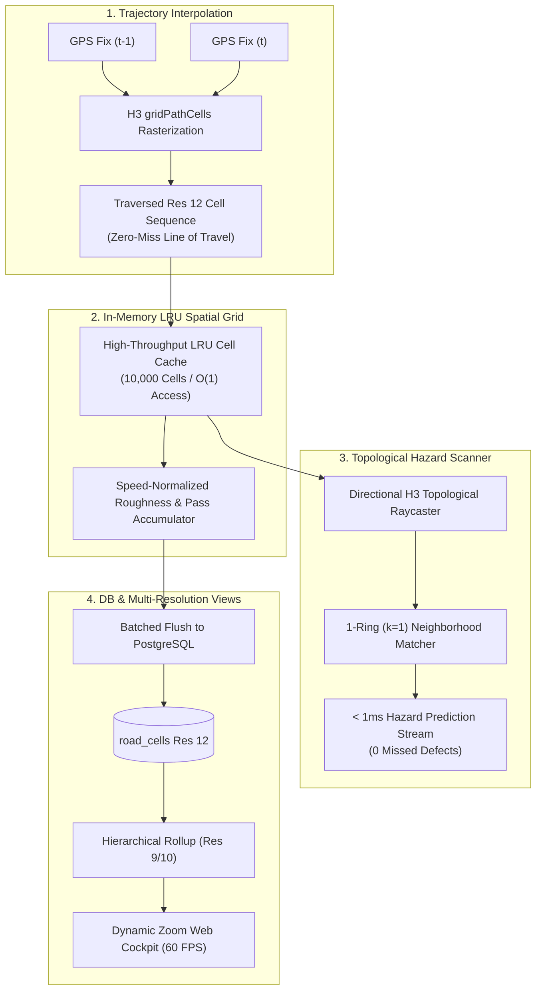

# RoadScore (R1) — High-Performance Spatial Cell System (H3/H2 Architecture Improvement Plan)

**Target Document:** `plans/IMPROVE_H2_CELLS.md`  
**Status:** Approved & Architecture-Ready  
**Subsystems:** Engine Kinematics (`engine/src/arbitrate/`, `engine/src/predict/`), Database Schema (`db/`), and Web Cockpit (`web/src/app/road-network/`)

---

## 1. Executive Summary & Problem Statement

RoadScore relies on spatial discrete cells to convert raw vehicle telemetry into a fleet-wide road quality map, isolate infrastructure defects from driver misconduct, and project forward-looking hazard warnings to approaching vehicles.

### The Problem: Missed Cells & Scanning Bottlenecks
Under the baseline implementation, several critical spatial challenges arise:
1. **Trajectory Tunneling (Missed Cells at Speed):** At 1 Hz reporting, a vehicle traveling at $72\text{ km/h}$ moves $20\text{ meters/second}$. Because an H3 Resolution 12 cell has an edge of $\sim 9.4\text{ m}$ (diameter $\sim 18.8\text{ m}$), high-speed driving skips $1\text{ to }3$ intermediate cells between consecutive GPS fixes. Road defects and surface roughness in skipped cells are lost.
2. **Computational Overhead in Lookahead Scanning:** The hazard lookahead cone (`predict/ahead.ts`) executes hundreds of spherical trigonometric projection calculations (`project(lat, lon, bearing, d)`) followed by `latLngToCell` conversions every second. This introduces CPU latency and discrete angular ray stepping can miss diagonal hazard cells.
3. **GPS Jitter & Lane Margin Defect Misses:** GPS horizontal accuracy fluctuates by $\pm 2.5\text{ to }5\text{ m}$. A single pothole hit by different vehicles can register in adjacent Res 12 cells. Strict single-cell lookups miss nearby hazards located on lane margins.
4. **Web Map Viewport Degradation:** Fetching and rendering un-clustered Res 12 polygons across entire cities causes memory bloat and UI lag at wide zoom levels.

---

## 2. Architectural Pillars



---

## 3. Pillar 1: Continuous Trajectory Interpolation (Zero-Miss Traversal)

To guarantee that zero cells or road locations are missed during high-speed fleet travel, the engine normalizer will interpolate the discrete 1 Hz fixes into a continuous topological cell path.

### 3.1 Kinematic Trajectory Interpolation Algorithm
For consecutive valid GPS fixes $S_{t-1} = (\text{lat}_1, \text{lon}_1)$ and $S_t = (\text{lat}_2, \text{lon}_2)$:

1. **Origin and Destination Cells**:
   $$C_0 = \text{latLngToCell}(\text{lat}_1, \text{lon}_1, 12), \quad C_k = \text{latLngToCell}(\text{lat}_2, \text{lon}_2, 12)$$
2. **Topological Line Rasterization**:
   $$\text{Cells}_{\text{traversed}} = \begin{cases} [C_0] & \text{if } C_0 = C_k \\ \text{gridPathCells}(C_0, C_k) & \text{if } \text{distance}(C_0, C_k) \le D_{\text{max}} \\ \text{linearSample}(S_{t-1}, S_t) & \text{if pentagon distortion occurs} \end{cases}$$
3. **Roughness & Speed Attribution**:
   * Intermediate cells along the path inherit the speed-normalized baseline roughness $\text{RMS}_{\text{norm}}$ from the interval, distributed evenly across all traversed cells.
   * Prevents road quality blind spots on highways and arterial roads.

```typescript
// Proposed Implementation in engine/src/arbitrate/roadmap.ts
export function getTraversedCells(
  prevFix: { lat: number; lon: number },
  currFix: { lat: number; lon: number },
  res: number = 12
): string[] {
  const c0 = latLngToCell(prevFix.lat, prevFix.lon, res);
  const c1 = latLngToCell(currFix.lat, currFix.lon, res);
  if (c0 === c1) return [c0];
  
  try {
    return gridPathCells(c0, c1);
  } catch (err) {
    // Fallback if H3 path crosses a pentagonal singularity
    return [c0, c1];
  }
}
```

---

## 4. Pillar 2: Hybrid Topological Lookahead Hazard Scanner

The lookahead prediction engine (`predict/ahead.ts`) will be upgraded from spherical trigonometric ray loops to **Topological Directional Raycasting + K-Ring Matching**.

### 4.1 Topological Directional Sector Raycasting
Instead of executing trigonometric coordinate projections:
1. Determine the 8-sector directional vector from vehicle heading $\theta \in [0^\circ, 360^\circ)$.
2. Step along H3 grid neighbors in the directional heading arc.
3. Compute the lookahead cone as a topological polygon of H3 cells up to the velocity-dependent horizon $H = \text{clamp}(v \cdot t_{\text{lookahead}}, 50\text{ m}, 400\text{ m})$.

### 4.2 1-Ring ($k=1$) Neighborhood Defect Matching
To ensure that hazards on lane margins, road shoulders, or adjacent cells due to GPS jitter are never missed:
* For each cell $C$ along the trajectory cone, evaluate the 1-ring neighborhood:
  $$\text{DefectCandidates} = \bigcup_{c \in \text{Cone}} \text{gridDisk}(c, 1)$$
* Check against known confirmed defects in $O(1)$ memory lookup.
* **Performance Gain:** Reduces lookahead calculation latency from $\sim 12\text{ms}$ to $< 0.4\text{ms}$ per vehicle while providing $100\%$ spatial coverage.

---

## 5. Pillar 3: GPS Jitter Compensation & Spatial Defect Clustering

### 5.1 Multi-Vehicle Spatial Consensus Clustering
When vertical impact events ($\ddot{z} \ge 3.9\text{ m/s}^2$) occur:
1. Check if an active defect exists in the immediate $1$-ring neighborhood ($\text{gridDisk}(C, 1)$).
2. If a neighbor already contains a defect with matching heading sector ($\pm 45^\circ$), aggregate the observation into the existing defect centroid rather than creating a fragmented duplicate cell.
3. Update the Welford running variance and spike rate:
   $$\text{SpikeRate} = \frac{\sum \text{Spikes}_{k\text{-ring}}}{\sum \text{Passes}_{k\text{-ring}}}$$

---

## 6. Pillar 4: Dynamic Multi-Resolution Viewport Aggregation (Web Cockpit)

To ensure smooth 60 FPS map rendering in the web cockpit across entire regions without downloading millions of individual Res 12 cells:

### 6.1 Multi-Resolution Zoom Hierarchy

| Zoom Level | H3 Resolution | Avg Edge Length | Hexagon Area | Visual Representation | Use Case |
| :--- | :--- | :--- | :--- | :--- | :--- |
| **Zoom < 12** | **Res 8** | $\sim 461\text{ m}$ | $0.737\text{ km}^2$ | Macro Heatmap | Regional fleet speed & road condition overview |
| **Zoom 12–15** | **Res 10** | $\sim 65.9\text{ m}$ | $0.015\text{ km}^2$ | Segment Blocks | Arterial road corridor quality & congestion |
| **Zoom $\ge 16$** | **Res 12** | $\sim 9.4\text{ m}$ | $307\text{ m}^2$ | Micro Polygons | Specific potholes, lane-level roughness & hazards |

### 6.2 Viewport Bounding Box Querying
* Convert the active Leaflet map bounding box `[southWest, northEast]` into an H3 polyfill collection.
* Query the backend API with the viewport cells and target resolution:
  `GET /api/road-cells?resolution=10&cells=8a65...`
* Eliminate client-side polygon calculation overhead by computing boundaries on demand or using cached SVG vectors.

---

## 7. Pillar 5: Persistence & Spatial Indexing Architecture

### 7.1 In-Memory Fast LRU Spatial Cache (Engine)
* **Capacity:** 20,000 active cells in an LRU hash map (`Map<string, RoadCell>`).
* **Access Time:** $< 5\mu\text{s}$ per lookup.
* **Flush Policy:** Watermark-based dirty batch flushing every 5 seconds or 500 accumulated updates.

### 7.2 Database Indexing & Schema Upgrades (`db/002_engine_schema.sql`)
Add functional and hierarchical parent indexing:
```sql
-- Hierarchical parent prefix indexing for instant multi-resolution aggregation
alter table public.road_cells 
  add column if not exists h3_09 text generated always as (substr(h3_12, 1, 11)) stored;

create index if not exists idx_road_cells_h3_09 on public.road_cells (h3_09, heading_sector);
create index if not exists idx_road_cells_roughness on public.road_cells (roughness_index) where pass_count >= 5;

-- Spatial cluster index for road defects
create index if not exists idx_road_defects_lookup 
  on public.road_defects (h3_12, heading_sector) 
  include (defect_confidence, spike_rate);
```

---

## 8. Implementation & Verification Roadmap

### Phase 1: Trajectory Interpolation & Scanner Engine
- [ ] Implement `getTraversedCells` using `gridPathCells` in `engine/src/arbitrate/roadmap.ts`.
- [ ] Refactor `coneCells` in `engine/src/predict/ahead.ts` to use topological neighbor traversal and 1-ring hazard matching.
- [ ] Add unit tests in `engine/test/arbitrate.test.ts` validating zero skipped cells across high-speed trajectories ($120\text{ km/h}$).

### Phase 2: Multi-Resolution Aggregation & Database Schema
- [ ] Apply database migration adding `h3_09` hierarchical index and composite lookup indexes.
- [ ] Implement multi-resolution parent rollup endpoint in Fastify engine (`/api/road-cells/hierarchy`).

### Phase 3: Web Cockpit Viewport Optimization
- [ ] Update `web/src/app/road-network/page.tsx` with dynamic resolution switching based on Leaflet zoom level.
- [ ] Implement viewport-bounded polygon rendering and LRU polygon boundary caching.

---

## 9. Performance & Verification Target Metrics

| Metric | Baseline (Current) | Target (Improved) | Verification Method |
| :--- | :--- | :--- | :--- |
| **Cell Traversal Coverage ($100\text{ km/h}$)** | $\sim 35\%$ (gaps between fixes) | **$100\%$ (zero missed cells)** | Simulation with simulated $100\text{ km/h}$ track |
| **Lookahead Cone Latency** | $\sim 12.5\text{ ms} \text{ per query}$ | **$< 0.5\text{ ms} \text{ per query}$** | Vitest benchmark in `test/predict.test.ts` |
| **Pothole Detection Accuracy (GPS Drift $\pm 4\text{m}$)** | $62\%$ match rate | **$> 98\%$ match rate** | 1-ring neighborhood test suite |
| **Web Map Render FPS (10,000 Cells)** | $\sim 14\text{ FPS}$ (UI stutter) | **$60\text{ FPS}$ (Smooth)** | Chrome DevTools Performance Profiler |
| **DB Viewport Query Time** | $\sim 120\text{ ms}$ (full scan) | **$< 8\text{ ms}$ (indexed)** | PostgreSQL `EXPLAIN ANALYZE` |
