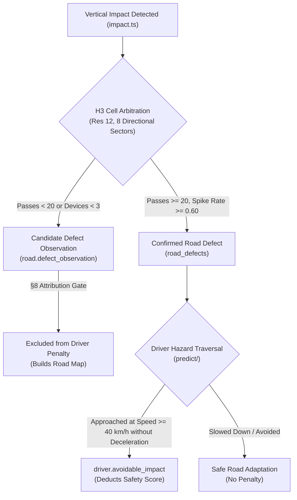

# RoadScore (R1) — Comprehensive System Validation Plan

This document defines the exhaustive, end-to-end verification and validation specification for the RoadScore (R1) platform. It covers every subsystem across the hardware edge, transport ingestion, kinematic detection pipeline, spatial arbitration, scoring math, database integrity, and web cockpit interface.

---

## 1. System Architecture & Validation Scope

```mermaid
flowchart TD
    subgraph Tier1 ["Tier 1: Edge Hardware (MCU)"]
        IMU["MPU-6050 (200 Hz IMU)"]
        GPS["NEO-6M GNSS (10 Hz)"]
        MIC["MEMS Mic (500 Hz)"]
        FIRM["ESP32 Firmware Pipeline"]
        IMU & GPS & MIC --> FIRM
    end

    subgraph Tier2 ["Tier 2: Ingestion & Transport"]
        HTTP["Fastify HTTP Ingest (/api/telemetry)"]
        SWEEP["PostgreSQL Watermark Sweeper"]
        REAL["Supabase Realtime Changes"]
        FIRM -->|1 Hz Batch| HTTP
        HTTP --> DB_RAW[(raw_telemetry)]
        DB_RAW --> REAL & SWEEP
    end

    subgraph Tier3 ["Tier 3: Detection & Normalization"]
        NORM["Normalizer & Integrity Suite"]
        DET_LONG["Longitudinal (Brake/Accel)"]
        DET_LAT["Lateral & Swerve (v · ω)"]
        DET_SPD["Speeding (H3 Cell p85)"]
        DET_IMP["Impact & Pothole Candidate"]
        DET_DUTY["Duty, Idle & Fatigue"]
        REAL & SWEEP --> NORM
        NORM --> DET_LONG & DET_LAT & DET_SPD & DET_IMP & DET_DUTY
    end

    subgraph Tier4 ["Tier 4: Spatial Arbitration & Prediction"]
        ARB["H3 Res 12 Spatial Map"]
        PRED["Hazard Cone Traversal"]
        DET_IMP --> ARB
        ARB --> PRED
    end

    subgraph Tier5 ["Tier 5: Section 8 Scoring Engine"]
        GATE["§8 Driver Attribution Gate"]
        FORMULA["Exposure-Normalized Scoring"]
        DECAY["24h Continuous Exponential Decay"]
        DET_LONG & DET_LAT & DET_SPD & DET_DUTY --> GATE
        PRED -->|driver.avoidable_impact| GATE
        ARB -->|road.defect_observation (Excluded)| GATE
        GATE --> FORMULA --> DECAY
    end

    subgraph Tier6 ["Tier 6: UI & Operational Dashboards"]
        WEB["Next.js 16 Web Dashboard"]
        DECAY --> WEB
    end
```

---

## 2. Telemetry Ingestion & Hardware Data Contract

### 2.1 1 Hz Payload Schema & Bitmask Flags
Every telemetry batch emitted by the ESP32 edge unit must satisfy the following schema and validation constraints:

```json
{
  "device_id": "esp32-alpha-01",
  "firmware_version": "1.2.0",
  "seq": 1420,
  "timestamp": "2026-08-15T10:30:00.000Z",
  "lat": 6.524379,
  "lon": 3.379206,
  "speed_kmh": 64.5,
  "heading": 184.2,
  "flags": 15,
  "vertical_accel_mps2": 0.58,
  "horizontal_peak_mps2": 4.82,
  "magnitude_peak_mps2": 10.45,
  "yaw_rate_radps": 0.40,
  "pitch_rate_radps": 0.01,
  "roll_rate_radps": 0.02,
  "mic_rms": 184.5,
  "mic_peak": 360.0,
  "samples_count": 50,
  "wifi_rssi": -62
}
```

### 2.2 Bitmask Validation Matrix
| Bit | Flag Constant | Hex Value | Required Condition | Pipeline Action if Cleared (`0`) |
| :--- | :--- | :--- | :--- | :--- |
| Bit 0 | `GPS_FIX` | `0x01` | Valid 2D/3D GNSS solution acquired | Discards geospatial positioning; disables distance accumulation. |
| Bit 1 | `GPS_USABLE` | `0x02` | $\text{HDOP} \le 3.5$ and $\text{Satellites} \ge 4$ | Suppresses speed compliance and spatial hazard mapping. |
| Bit 2 | `ACCEL_VALID` | `0x04` | Baseline gravity vector calibrated ($\|\mathbf{g}\| \approx 9.81\text{ m/s}^2$) | Suppresses all vertical and longitudinal dynamics detectors. |
| Bit 3 | `GYRO_VALID` | `0x08` | Zero-rate offset calibrated ($|\omega_{\text{bias}}| \le 0.05\text{ rad/s}$) | Suppresses lateral cornering and swerving detectors. |
| Bit 4 | `MIC_VALID` | `0x10` | Acoustic ADC signal present ($V_{\text{RMS}} > 0$) | Reverts idling detection to baseline confidence ($0.30$). |

---

## 3. Kinematic Detection Pipeline Validation

The engine runs six specialized physical detectors. Each detector is governed by physical constraints, multi-sensor corroboration, and false-positive suppression rules.

### 3.1 Detector 1: Longitudinal Dynamics (`longitudinal.ts`)
* **Physical Formula**: Decomposes 3-axis accelerometer against low-pass gravity baseline ($\mathbf{g}_{\text{ref}}$) to isolate true longitudinal acceleration $a_{\text{long}}$.
* **Validation Equation**: 
  $$\Delta v_{\text{GPS}} \approx \int_{t_0}^{t_1} a_{\text{long}}\,dt$$
* **Severity Thresholds**:
  * **Harsh Braking** (`driver.harsh_brake`):
    * Low: $a_{\text{long}} \le -3.0\text{ m/s}^2$ ($-0.31\text{ g}$)
    * Medium: $a_{\text{long}} \le -4.5\text{ m/s}^2$ ($-0.46\text{ g}$)
    * High: $a_{\text{long}} \le -6.0\text{ m/s}^2$ ($-0.61\text{ g}$)
  * **Harsh Acceleration** (`driver.harsh_accel`):
    * Low: $a_{\text{long}} \ge +2.5\text{ m/s}^2$ ($+0.25\text{ g}$)
    * Medium: $a_{\text{long}} \ge +3.5\text{ m/s}^2$ ($+0.36\text{ g}$)
    * High: $a_{\text{long}} \ge +4.5\text{ m/s}^2$ ($+0.46\text{ g}$)
* **Fairness Suppression Rule**: If gyroscope yaw rate $|\omega| > 0.175\text{ rad/s}$ ($10^\circ/\text{s}$), braking detection is suppressed to prevent vehicle body roll during sharp turns from falsely triggering longitudinal braking.

### 3.2 Detector 2: Lateral Cornering Dynamics (`lateral.ts`)
* **Physical Formula**: Calculates centripetal acceleration $a_{\text{lat}} = v \cdot \omega$ from GPS speed $v$ ($\text{m/s}$) and gyroscope yaw rate $\omega$ ($\text{rad/s}$).
* **Severity Thresholds**:
  * **Sharp Corner** (`driver.sharp_corner`): $\omega \ge 0.26\text{ rad/s}$ ($15^\circ/\text{s}$) at $v \ge 20\text{ km/h}$.
  * **Excessive Cornering Speed** (`driver.excessive_cornering_speed`):
    * Low: $a_{\text{lat}} \ge 3.4\text{ m/s}^2$ ($0.35\text{ g}$)
    * Medium: $a_{\text{lat}} \ge 4.9\text{ m/s}^2$ ($0.50\text{ g}$)
    * High: $a_{\text{lat}} \ge 5.9\text{ m/s}^2$ ($0.60\text{ g}$)
* **Cross-Sensor Corroboration Rule**: Sensor-fusion validates that the change in GPS heading matches the integrated yaw rate:
  $$\left|\frac{\Delta \theta_{\text{GPS}}}{\Delta t} - \omega\right| \le 0.15\text{ rad/s}$$
  If the GPS heading does not rotate, the event is rejected as gyro drift or vehicle shake.

### 3.3 Detector 3: High-Speed Swerving (`swerve.ts`)
* **Physical Formula**: Integrates continuous yaw rate over a sliding 2.5-second window:
  $$\Theta_{\text{total}} = \int_{0}^{T} |\omega(t)|\,dt, \quad \Delta\theta_{\text{net}} = |\theta(T) - \theta(0)|$$
* **Trigger Conditions**:
  1. Accumulated turn angle $\Theta_{\text{total}} \ge 1.05\text{ rad}$ ($60^\circ$).
  2. Net heading change $\Delta\theta_{\text{net}} \le 0.35\text{ rad}$ ($20^\circ$) — confirming lane weave rather than a legitimate corner.
  3. Minimum speed $v \ge 40\text{ km/h}$.
  4. Oscillations count $\ge 3$ zero-crossings.

### 3.4 Detector 4: Speed Compliance (`speed.ts`)
* **Physical Formula**: Compares GPS speed $v$ against the historical 85th-percentile fleet speed baseline ($p_{85}$) stored in the corresponding H3 Resolution 12 geospatial cell.
* **Consensus Gate**: Requires $\ge 20$ historical passes from $\ge 3$ distinct devices in that cell; otherwise emits nothing (prevents single-device bias).
* **Severity Thresholds** (`driver.speeding_relative`):
  * Low: $v \ge 1.10 \times p_{85}$ ($+10\%$)
  * Medium: $v \ge 1.25 \times p_{85}$ ($+25\%$)
  * High: $v \ge 1.40 \times p_{85}$ ($+40\%$)
* **Condition-Aware Rule** (`driver.speeding_for_conditions`): Emits when $v \ge p_{85}$ while surface roughness index is above the fleet median ($R_{\text{index}} > R_{\text{median}}$).

### 3.5 Detector 5: Vertical Road Impact & Potholes (`impact.ts`)
* **Physical Formula**: Evaluates normalized vertical acceleration RMS and peak shock $\ddot{z}$:
  $$\text{RMS}_{\text{norm}} = \text{RMS}_{\text{obs}} \cdot \left(\frac{v_{\text{ref}}}{\max(v, v_{\text{floor}})}\right)^\beta, \quad \beta = 1.0$$
* **Impact Trigger**: Peak vertical acceleration $\ddot{z} \ge 3.9\text{ m/s}^2$ ($0.40\text{ g}$) accompanied by an acoustic microphone burst ($E_{\text{mic}} \ge 2.5 \times \text{ambient}$).
* **Censoring Protection Rule**: At $\pm 2\text{ g}$ sensor limits, clipped acceleration spikes are capped at `high` severity and never extrapolated to `critical` (§2.4 guarantee).

### 3.6 Detector 6: Duty, Idling & Fatigue (`duty.ts`)
* **Excessive Idling** (`driver.excessive_idling`):
  * Trigger: Vehicle stationary ($v < 2\text{ km/h}$) for $\ge 180\text{s}$ ($3\text{ minutes}$) while active.
  * Acoustic Corroboration: If $E_{\text{mic}} > 1.2 \times E_{\text{ambient}}$, confidence is set to $0.65$; otherwise capped at $0.30$.
* **Continuous Driving Fatigue** (`driver.continuous_driving`):
  * Trigger: Continuous driving duration $\ge 7,200\text{s}$ ($2\text{ hours}$) without a $5\text{ minute}$ stop.

---

## 4. Crowd-Sourced Spatial Arbitration (§7.3)

RoadScore isolates infrastructure defects from driver misconduct using multi-vehicle spatial consensus.



### 4.1 Arbitration Consensus Equations
For every H3 Resolution 12 cell ($~300\text{ m}^2$) and 8 heading sectors ($45^\circ$ each):
1. **Online Running Mean & Variance** (Welford's algorithm):
   $$\bar{x}_n = \bar{x}_{n-1} + \frac{x_n - \bar{x}_{n-1}}{n}$$
   $$M_{2,n} = M_{2,n-1} + (x_n - \bar{x}_{n-1})(x_n - \bar{x}_n)$$
   $$\sigma_n^2 = \frac{M_{2,n}}{n - 1}$$
2. **Defect Classification Gate**:
   $$\text{Spike Rate} = \frac{\text{Spike Passes}}{\text{Total Passes}}$$
   * $\text{Spike Rate} \ge 0.60 \implies$ Promoted to **Confirmed Road Defect**.
   * $\text{Spike Rate} \le 0.25 \implies$ Classified as isolated driving event.

---

## 5. Section 8 Scoring Mathematics & Invariants

### 5.1 Exposure-Normalized Penalty Formula
$$\text{Raw Penalty} = \sum_{e \in \text{Events}} w(e) \cdot m(\text{sev}_e) \cdot c_e$$
$$\text{Exposure} = \max(\text{Distance}_{\text{km}}, 1.0)$$
$$\text{Score} = \text{clamp}\left(100 - \frac{100 \cdot \text{Raw Penalty}}{\text{Exposure} \cdot k}, 0, 100\right), \quad k = 2.0$$

### 5.2 Scoring Invariant Assertions
Every automated test run validates five non-negotiable invariants:

| Invariant | Formal Statement | Validation Method |
| :--- | :--- | :--- |
| **I-1: Attribution Gate** | $\forall e \text{ where } \text{attributed} = \text{false} \implies \text{Penalty}(e) = 0$ | Verified in `test/score.test.ts`. Unmapped potholes and sensor events never deduct points. |
| **I-2: Integrity Exclusion** | $\forall e \text{ where } \text{category} = \text{'integrity'} \implies \text{Penalty}(e) = 0$ | Verified against GPS loss, mount shift, and clock drift events. |
| **I-3: Score Reconciliation** | $|\text{Score}_{\text{stored}} - \text{Score}_{\text{recalculated}}| \le 0.01$ | Reconciled against `score.breakdown.contributions` JSON. |
| **I-4: Exposure Monotonicity** | Safe driving with zero events strictly increases score towards 100. | Verified over 100 km test simulation. |
| **I-5: Denominator Floor** | $\text{Exposure} \ge 1.0\text{ km}$ | Prevents a single minor event on a 200 m trip from yielding a 0 score. |

---

## 6. End-to-End Simulation Test Battery

The system includes 11 automated simulation scenarios located in [`engine/src/sim/scenarios.ts`](file:///home/gav/Projects/roadscore-r1/engine/src/sim/scenarios.ts).

```
+----------------------------------------------------------------------------------------------------+
|                                    11-SCENARIO TEST MATRIX                                         |
+----+-----------------------+------------------------------------------+----------------------------+
| #  | Scenario Key          | Physical Telemetry Profile               | Expected Pipeline Output   |
+----+-----------------------+------------------------------------------+----------------------------+
| 1  | worst-driver          | 115 km/h, -7.8 m/s² brake, 10.25 m/s² lat| 5-Factor scores drop to 0  |
| 2  | driver-penalties      | Smooth road with sharp brake & accel     | Longitudinal & Lateral pen |
| 3  | pothole-cluster       | High vertical z spikes (> 4.5 m/s²)      | road.defect_observation    |
| 4  | tunnel-underpass      | GPS lock lost for 45 seconds             | integrity.gps_gap          |
| 5  | stop-and-go           | Speed < 2 km/h for 200 seconds           | driver.excessive_idling    |
| 6  | continuous-driving    | Continuous speed > 50 km/h for 2.2 hours | driver.continuous_driving  |
| 7  | gyro-drift            | Yaw rate offset 0.12 rad/s, heading flat | Rejected (0 events)        |
| 8  | loose-mount           | Device orientation shift > 15 degrees    | integrity.mount_shift      |
| 9  | depot-maneuver        | Low-speed yard shock at 8 km/h           | depot.yard_shunt_impact    |
| 10 | mixed-fleet           | Multi-device traversals across H3 cells  | Road map p85 populated     |
| 11 | clean-highway         | 90 km/h highway cruise, smooth dynamics  | 100 / 100 Perfect Score    |
+----+-----------------------+------------------------------------------+----------------------------+
```

---

## 7. Web Dashboard & UI Verification

### 7.1 Test Checklist
- [x] **Sidebar Collapsed State**: Verify that collapsing the left navbar (`w-14`) hides the green branding dot and centers the chevron toggle button cleanly.
- [x] **5-Factor Radar Graph**: Verify that `calculateFactorRadarScores` accurately maps:
  - Longitudinal Dynamics $\to$ `harsh_brake`, `harsh_accel`
  - Cornering & Lateral $\to$ `sharp_corner`, `excessive_cornering_speed`, `swerving`
  - Speed Compliance $\to$ `speeding_relative`, `speeding_for_conditions`
  - Road Risk Adaptation $\to$ `avoidable_impact`
  - Eco & Operational Habits $\to$ `excessive_idling`, `continuous_driving`
- [x] **Score Audit Drawer**: Verify that clicking any driver score opens the breakdown drawer displaying every contributing event key, timestamp, physical magnitude, confidence multiplier, and mathematical reconciliation.
- [x] **Kinematic Trip Replay**: Verify telemetry playback renders GPS polylines with synchronized acceleration and speed graphs.
- [x] **Realtime WebSocket Ingest**: Verify new rows in `raw_telemetry` immediately update active vehicle markers without full-page refresh.

---

## 8. Step-by-Step Validation Execution Runbook

### Step 1: Execute Complete Engine Test Suite
```bash
cd engine
npm test
```
*Expected Output*: `204 passed (204)`, duration $< 2.0\text{s}$.

### Step 2: Validate TypeScript Compilation
```bash
npm run typecheck
```
*Expected Output*: Exit code `0` with 0 errors.

### Step 3: Run Full Scenario Battery
```bash
npm run sim:scenarios
```
*Expected Output*: All 11 scenarios execute through normalizer, detectors, arbitration, and scoring pipeline without uncaught exceptions.

### Step 4: Verify Web Production Build
```bash
cd ../web
npm run build
```
*Expected Output*: Next.js 16 (Turbopack) compiles all 16 static and dynamic routes with 0 errors.

### Step 5: Execute Live Dev Orchestrator
```bash
cd ..
./dev.sh --worst
```
*Expected Output*: 
- Web UI accessible at [http://localhost:3000](http://localhost:3000)
- Engine API operational at [http://localhost:3001](http://localhost:3001)
- Live telemetry stream continuously updates the Cockpit HUD, active trip view, and driver scorecard radar.
